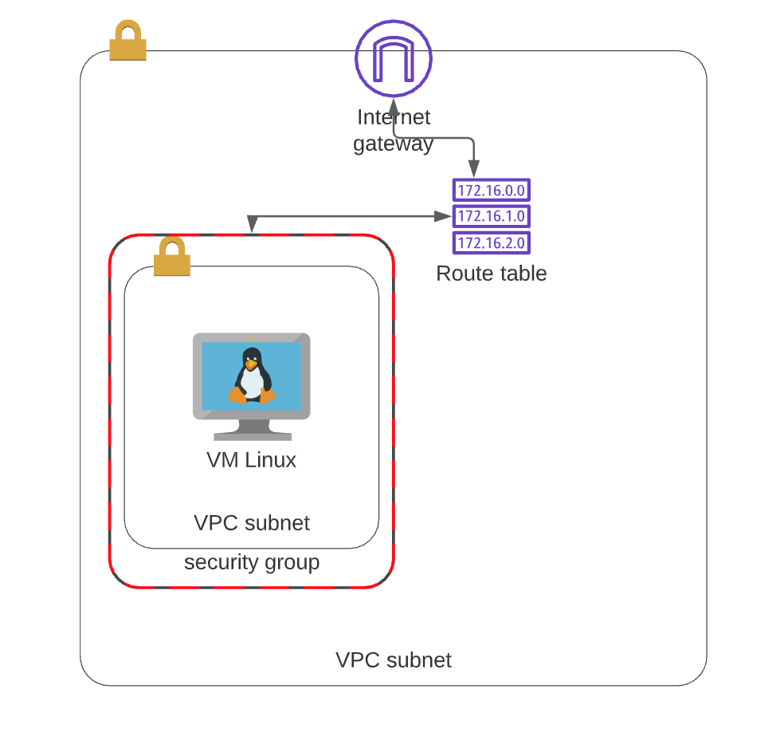

# Corda_Project

### objective : To deploy an examlpe coDapp onto a linux public cloud machine using automation technologies.

### My method
sprint 1: deploy the application manually. this would give me the knowldeg of the exact requirments which need to be configures inside he ansible files.sprint 2. automate this process taken what has been learnt from sprint 1. the automation tools consist of Terraform and Ansible and the the cloud provied being AWS. Terrafrom was used to provision the enviorment for the linux irtual machine hosted on AWS, Ansible would then make all installations on that server so that the CoDapp can be deployed.

### Summarry
to summarise the application was succesfully deployed manually as seen in figure 1. Along with this an t2-medium ubuntu machine was provisoned using terrafrom to host the application on. Inorder to create an instance aws best architecture practices was used for example, creating a user and placeing that user into a group with the correct permisions to complete this task. Finally Four ansible files was created to install all software and clone down the application from github.

 

## Architecture using Terrafrom

Using Terrafrom a Vpc was created with an internet gateway. this internet gateway gave access to all recources inside the VPC, allowing them to connect to the internet and the internet to them. the route table was created to direct the incoming traffic from the internet gateway to the public subnet. Also Security groups had to be configured, this would allowed ssh into machine or even access onto the front end of the CoDapp application on port 5005. 

## Ansible
below is the files used to provison the enviorment on the instance. A file to instal OpenJDK8, a file to clone down the CoDapp sample application and a file to to insall gradel 5.4.1 as this is the only version which workds with Corda.

## Conclusion

In conclusion, I followed the requirements set by the R3 team and my sprints, which resulted in a successful deploying a Cordapp application. Working on a feature branch allowed me to work without worrying about breaking the application as the master branch always had the working code from the most recent push. Although the application could not be completey automated, i have broaened my knowldge in using ansible-playbook to to autotmate tasks and i now understand how to deploy a CorDapp.

 ## identified inssues

 using ansible to curl gradel5.4.1 for the distrubuter. the curl command would work manually, hence why the application was deployed. however when using this command inside the yaml file the website could not be reached and returned the error below. So after much reaserch and attempts i tried to use the "user data" module as i have experience with is. in theory upon boting the ami a list of commmands wil be run which and this was delcared inside the terraform file for the ec2 resource. This still did not work. For future develope i will try to install homebrew using the ansible paybook and then running a following play to install gradel 5.4.1 using this.

 the aws instance used to deploy the application was to small in ram. this was discovered when trying to build the nodes inside the sample application. to fix this the ec2 resource inside the terraform file has to be updated to a t2 medium. 

 ## futre impovements

## MIT License

Copyright (c) 2021 JasonSinclair95

Permission is hereby granted, free of charge, to any person obtaining a copy
of this software and associated documentation files (the "Software"), to deal
in the Software without restriction, including without limitation the rights
to use, copy, modify, merge, publish, distribute, sublicense, and/or sell
copies of the Software, and to permit persons to whom the Software is
furnished to do so, subject to the following conditions:

The above copyright notice and this permission notice shall be included in all
copies or substantial portions of the Software.

THE SOFTWARE IS PROVIDED "AS IS", WITHOUT WARRANTY OF ANY KIND, EXPRESS OR
IMPLIED, INCLUDING BUT NOT LIMITED TO THE WARRANTIES OF MERCHANTABILITY,
FITNESS FOR A PARTICULAR PURPOSE AND NONINFRINGEMENT. IN NO EVENT SHALL THE
AUTHORS OR COPYRIGHT HOLDERS BE LIABLE FOR ANY CLAIM, DAMAGES OR OTHER
LIABILITY, WHETHER IN AN ACTION OF CONTRACT, TORT OR OTHERWISE, ARISING FROM,
OUT OF OR IN CONNECTION WITH THE SOFTWARE OR THE USE OR OTHER DEALINGS IN THE
SOFTWARE.