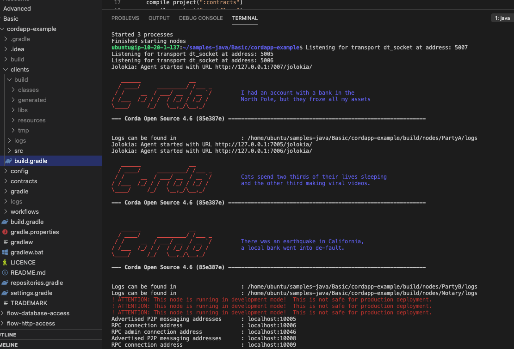
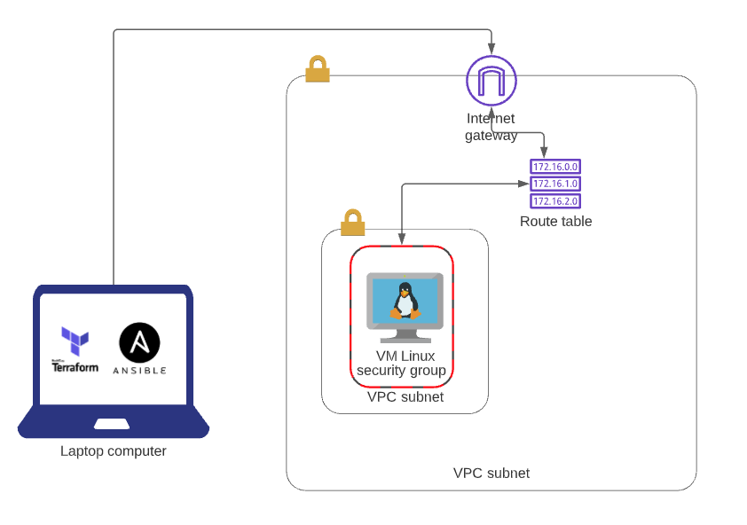

# Corda_Project

### objective : To deploy an examlpe coDapp onto a linux public cloud machine using automation technologies.

---

### Contents
1. [Critical Review](#Executive-Summary)
    1. My Method
    1. Summary

2. [Architecture and Terraform](#Architecture) 

3. [Ansible](#Ansible)

6. [Conclusion](#Conclusion)
    1. Identified Issues
    1. Future Improvements

8. [License](#License)

--- 

## Executive-Summary
### My method
sprint 1: Deploy the application manually. This would give me first hand experience with deploying a CorDapp. Along with this, the exact requirements which is needed to be configured inside the Ansible-playbook files. Two bash scripts was created to install ansible and terraform.

sprint 2: Automate this process taking what has been learnt from sprint 1. The automation tools consist of Terraform and Ansible and the the cloud provided AWS. Terraform will be used to provision the environment for the linux virtual machine hosted on AWS, Ansible would then make all installations on that server so that the CoDapp can be deployed.

---

### Summarry
To summarise the application was successfully deployed manually as seen below. Along with this an t2-medium ubuntu machine was provisioned using Terrafrom to host the application. In order to create an instance aws best architecture practices was used for example, creating a user and placing that user into a group with the correct permissions to complete this task. Finally three Ansible files was created to install all software and clone down the application from github before finally deploying the app.

 

---

## Architecture

Using Terrafrom a VPC was created with an internet gateway. This internet gateway gave access to all resources inside the VPC, allowing them to connect to the internet and the internet to them. The route table was created to direct the incoming traffic from the internet gateway to the public subnet. Also Security groups had to be configured, this would allow ssh from my local machine into this instance or even access onto the front end of the CoDapp application on port 5005. 

---

## Ansible
As mentioned above, to confiugure the linux machine three files was created. A file to install OpenJDK-8, a file to clone down the CoDapp sample application and a file to to install gradel 5.4.1 as this is the only version which works with Corda. The Ansible config file has been disclosed for privacy and to not export the ip address of the virtual machine. For security purposes an aws key was used to ssh into the machine so the public key had to be copied from the local machine and placed inside the instance, in order to run any Ansible commands. Below is an example of an successful playbook execution.

--- 

## Conclusion

In conclusion, I followed the requirements set by the R3 team and my sprints, which resulted in successfully deploying a Corda application. Working on a feature branch allowed me to work without worrying about breaking the application as the master branch always had the working code on-it. Although the application could not be completely automated, I have broadened my knowledge in using Ansible-playbook to automate tasks across virtual machines, Terraform to architect an environment on AWS and how to deploy a Corda application.

---

 ## Identified Issues

Using Ansible to curl gradel5.4.1 from the distributor. The curl command would work manually, hence why the application was deployed manually. However, when using this command inside the yaml file the website could not be reached and returned an error. I have posted a question on stack overflow to help with this however while I wait I have attempted the following... I have tried to utilise the "user data" module inside the ec2 resource in terraform. In theory upon starting the instance on aws ,a bash script would be run installing gradel using the curl command. Although the script ran, the zip file still did not curl. For future self development I will try to install home-brew using the Ansible-playbook and then running a following play to install gradel 5.4.1 using brew.

The AWS instance used to deploy the application was to small in ram. This was discovered when trying to build the nodes inside the sample application. The solution was to change the ec2 resource inside the terraform file from a t2-micro to a t2 medium. 

---

 ## Future Impovements
* I would Dockerise the application on the linux machine. A docker file would be created and placed onto the directory cordapp_example. This would be used to isolate part of the application. The image of the application can then be deployed using pehaps AWS EKS or docker swarm with multiple duplicates to increase durability and scalability.

* The Ansible files could be compacted into one. This way, it is more efficient because it will only take one command to run the playbook to set up the complete environment. The order of the tasks would go as follows, openJDK, gradle, git clone. For clarity it was separated for this task.

* Jenkins would be used to allow developers to continuously integrate new code into the cordapp_example without effecting the experience of the user. Jenkins would then be triggered a push to github.

* I would have fully automated the process of deploying this cordapp, installing Gradel etc.. 

* I would run the nodes after deploying the application which will bring the corda network online. This will give me first hand experince interacting with the nodes, runnning a flow and seeing how the nodes work together and trasaction/contracts are made between partys in privacy.

* I would become more familiar with java as CorApps are created with this language.

---

## Author
Jason Sinclair

---
## Acknowledgments
The R3 team for giving me oportunity to deploy my first CorDapp and showcase my skillset with DevOps Technooloiegs.

---
## License

Copyright (c) 2021 JasonSinclair95

Permission is hereby granted, free of charge, to any person obtaining a copy
of this software and associated documentation files (the "Software"), to deal
in the Software without restriction, including without limitation the rights
to use, copy, modify, merge, publish, distribute, sublicense, and/or sell
copies of the Software, and to permit persons to whom the Software is
furnished to do so, subject to the following conditions:

The above copyright notice and this permission notice shall be included in all
copies or substantial portions of the Software.

THE SOFTWARE IS PROVIDED "AS IS", WITHOUT WARRANTY OF ANY KIND, EXPRESS OR
IMPLIED, INCLUDING BUT NOT LIMITED TO THE WARRANTIES OF MERCHANTABILITY,
FITNESS FOR A PARTICULAR PURPOSE AND NONINFRINGEMENT. IN NO EVENT SHALL THE
AUTHORS OR COPYRIGHT HOLDERS BE LIABLE FOR ANY CLAIM, DAMAGES OR OTHER
LIABILITY, WHETHER IN AN ACTION OF CONTRACT, TORT OR OTHERWISE, ARISING FROM,
OUT OF OR IN CONNECTION WITH THE SOFTWARE OR THE USE OR OTHER DEALINGS IN THE
SOFTWARE.